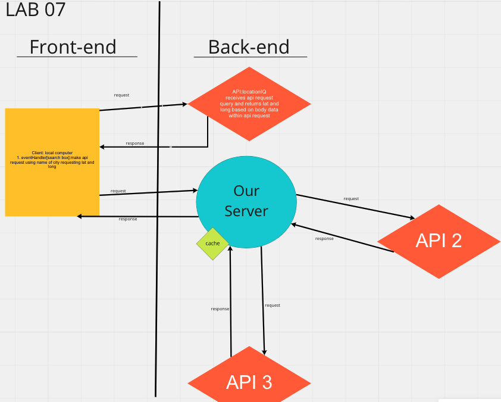
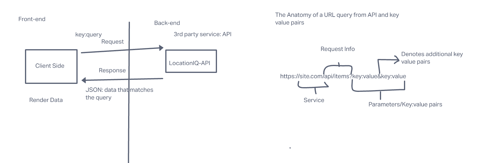

# My First Server
## lab07 

**Author**: Nathan Waters
**Version**: 1.0.0 (increment the patch/fix version number if you make more commits past your first submission)

## Overview
This is a server that is used to interface with APIs in order to get specific data that the user requests.

## Getting Started
they must get a key from the cites for permission. 

## Architecture
This application uses axios to pull data from an API and a server that has APIs connected to it. It is written with React and react-bootstrap.

## Change Log
<!-- Use this area to document the iterative changes made to your application as each feature is successfully implemented. Use time stamps. Here's an example:

01-01-2001 4:59pm - Application now has a fully-functional express server, with a GET route for the location resource. -->

## Credit and Collaborations
this was done alone.

Name of feature: Setting up first server

Estimate of time needed to complete: 2hr

Start time:7:44 am

Finish time: 5:29 pm 2 days later

Actual time needed to complete: 46 hr